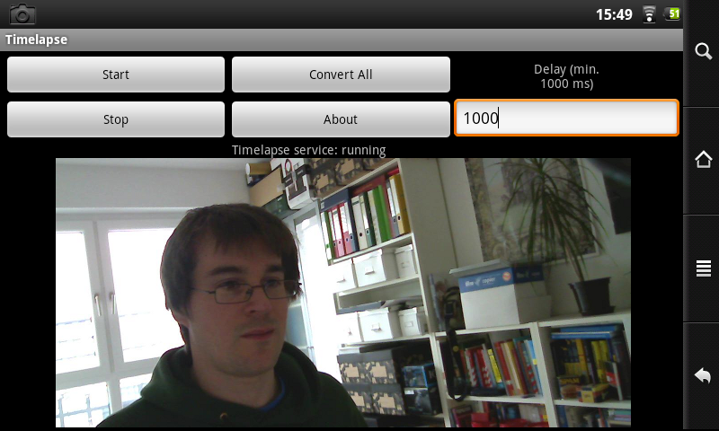

# Background-Timelapse

This [Android app](https://play.google.com/store/apps/details?id=floe.timelapse) continuously captures camera images in the background for timelapse videos (see [Youtube](https://www.youtube.com/watch?v=5VF4E-XIsWc) for a sample).

Delay between images is adjustable down to 1 second. Normal phone operation can continue with minimal CPU load.
Note: images are saved on SD card as JPEG. Not yet tested on Android 10, which introduced (another round of) changes to external storage handling.

Should _in theory_ run on anything from Android 1.6 up to Android 9 at least - in practice, you'll just have to try it to see if your specific camera implementation plays along or not.
